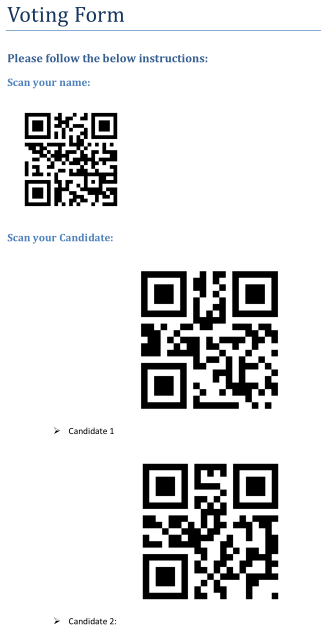
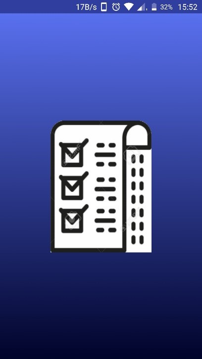
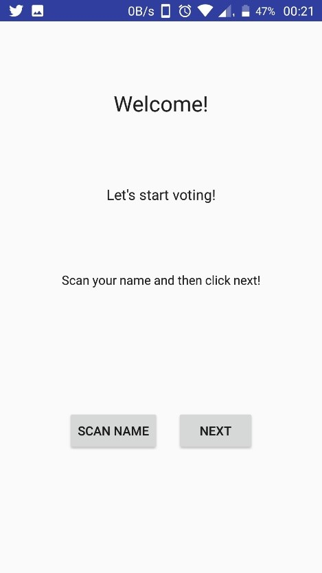
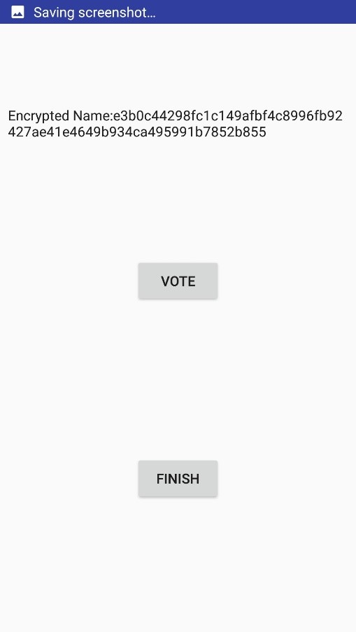
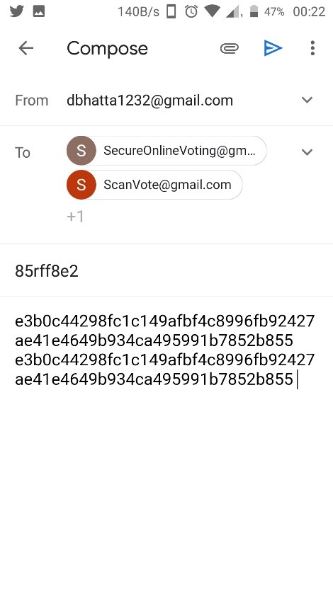

# Welcome to Secure Voting Online

## About

Voting is a right to every citizen. It gives the choice of the people to whom they want to up hold the meaning of a system governed by the people’s choice. However, representing elections have become a debatable issue. Different techniques of voting have evolved from simple manual voting to internet voting systems that only require the voter to come from the comfort of their home to vote their candidate from their personal computers. An election system should be able to overcome different hacking and fraud techniques. To overcome different complications and to reinforce the checking and calculating results, the project suggests the use of hashing. Authentication is made by comparing hashes using SHA-256. The system is more secured. Vote can be audited later by comparing hashes in a database.
Online voting or E-voting refers to voting using electronic means to either aid or take care of the chores of casting and counting votes.

Depending on the particular implementation, e-voting may use computers connected to the internet. It encompasses a range of Internet services, from basic data transmission to full-function online voting through common connectable consumer devices.

The proliferation of personal mobile devices in the form of tablets and smartphones, based on the Android operating system, presents a unique opportunity to empower isolated communities who traditionally have had a difficult time voting.

## Link to App

You can download the app at [Secure Voting Online](https://github.com/D-Bhatta/Secure-Online-Voting/raw/master/app/release/app-release.apk)

## Our System

Relevant agencies tasked with conducting the election shall make use of the National Electoral Roll
database and send all registered voters a letter with information about the voting process.

The user opens the app and scans 2 pieces of information from the letter:

1. Information that authenticates him and his vote
2. The code that indicates his vote

These two pieces are not stored but immediately collected by the Google Gmail App. A ready-to-send
email is generated with the two pieces of information. The user can then send the email. Gmail's built
in header auditing and caching infrastructure will ensure that the email reaches its destination safe from
malactors such as hackers, phishers, etc.

The government can then audit the vote itself with the relevant information provided, ensuring a reliable
and rigorous election.

## Steps To Be Followed

1. User receives a letter with scan-able information.
2. User opens the app and scans his own information as well as the candidate he chooses to vote
for.
3. An email in the Gmail App is automatically generated with encrypted data.
4. The user sends this email.
5. Email received is used to count votes for candidates.
6. The received email is verified and will count as a single vote.
7. The vote can be audited by verifying hashed user information.

Technologies Leveraged

### Gmail

Gmail is a zero-price, advertising-supported email service developed by Google. Users can access
Gmail on the web and through mobile apps for Android and iOS, as well as through third-party
programs that synchronize email content through POP or IMAP protocols. Gmail has one billion active
users worldwide, and according to a Radicati Group study from January 2017, there will be more than
3.7 billion email users worldwide by the end of the year.
Google's mail servers automatically scan emails for multiple purposes, including to filter spam and
malware. Gmail's spam filtering features a community-driven system: when any user marks an email
as spam, this provides information to help the system identify similar future messages for all Gmail
users.
As such, Gmail is contextually effective infrastructure in pursuit of secure online voting.

### Android operating system

Android is a mobile operating system developed by Google, based on the Linux kernel and designed
primarily for touch screen mobile devices such as smart phones and tablets.
Android's user interface is mainly based on direct manipulation, using touch gestures that loosely
correspond to real-world actions, such as swiping, tapping and pinching, to manipulate on-screen
objects, along with a virtual keyboard for text input. In addition to touch screen devices,
Android applications ("apps") can be downloaded from the Google Play store, which features over 2.7
million apps as of February 2017. Android has been the best-selling OS on tablets since 2013, and runs
on the vast majority of smart phones. As of May 2017, Android has two billion monthly active users,
and it has the largest installed base of any operating system.

### Zxing

ZXing ("Zebra Crossing") barcode scanning library for Java, Android.
ZXing ("zebra crossing") is an open-source, multi-format 1D/2D barcode image processing library
implemented in Java, with ports to other languages.

## Advantages

1. The system can be used anytime and from anywhere by the Voters.
2. No one can cast votes on behalf of others and multiple times.
3. Saves time and reduces human intervention.
4. The system is flexible and secured to be used.
5. Unique Identification of voter through user info hashes.
6. Extremely secure system with one time password.
7. Improves voting with friendly Android Interface.
8. No fraud vote can be submitted.

## Target Audience

- Citizens who wish to vote in privacy of their homes
- Citizens who vote in violence-prone areas
- Citizens in remote areas who have difficulty in reaching voting stations
- Citizens who have difficulty in reaching voting stations due to lack of infrastructure in
underdeveloped areas.

## Screenshots

_Voting Form_

_Splash Screen_

_Welcome Screen_

_Voting Screen_

_Email Screen_
